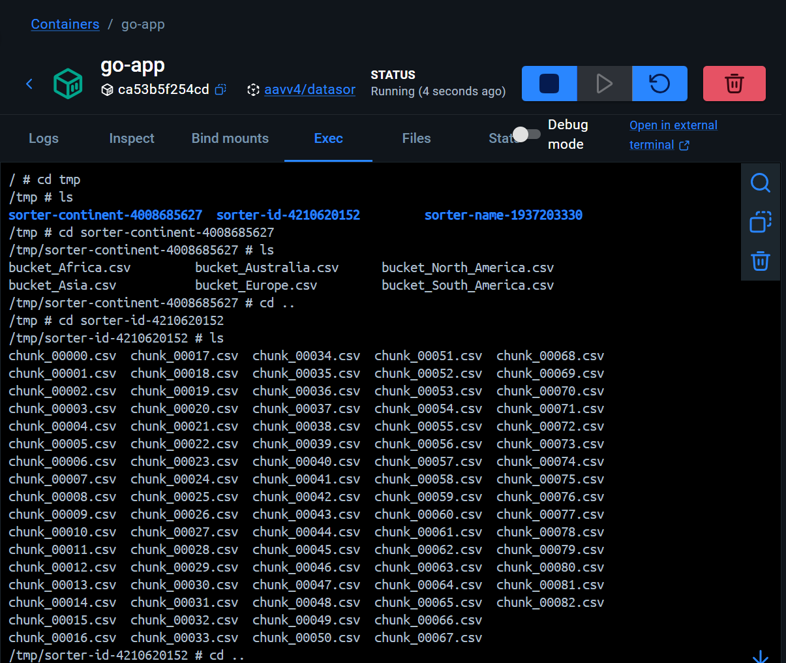

# How to Run

**Prerequisites:** Docker and Docker Compose. Nothing else.

---

## Option 1 — Pull image from Docker Hub (recommended)

Direct Link to download docker-compose file from repository
```bash
https://raw.githubusercontent.com/AnirudhV213/DataSorter/main/docker-compose.yaml
```
No source code needed. Just download the docker-compose.yaml from the repo and run:
```bash
docker compose up
```

Compose pulls `apache/kafka:3.7.0` and `aavv4/datasorter-app:latest` from Docker Hub, starts Kafka, waits for it to be healthy, then runs the full pipeline automatically.

**Stop:**
```bash
docker compose down
```

---

## Option 2 — Build from source locally

Use this if you have cloned the repo and want to build the image yourself.

```bash
git clone https://github.com/AnirudhV16/DataSorter.git
cd DataSorter
docker compose up --build
```

The `--build` flag forces Docker to build the app image from the local source instead of pulling it from Docker Hub.

**Stop:**
```bash
docker compose down
```

---

## Wait for completion

Both options print a step-by-step summary when the pipeline finishes:

```
═══ Step 1: Generating 50000000 records → data.csv ═══
═══ Step 2: Producing data.csv → Kafka topic "source" ═══
═══ Step 3: Running sorters (id / name / continent) ═══
✓ Full pipeline complete. Total wall-clock: ~800s
```

---

## Verify correctness (optional)

Direct Link to download verify.sh file from repository
```
https://raw.githubusercontent.com/AnirudhV213/DataSorter/main/scripts/verify.sh
```
Then Run this command to verify the sorted data
```
bash scripts/verify.sh
```

Prints the first 10 records from each output topic. Check that:
- **id** — ascending numeric order by the first column.
- **name** — ascending alphabetical order by the second column.
- **continent** — ascending alphabetical order by the fourth column.

---
## Internals — Temporary Sort Files

During Step 3 (sorting), the Go app writes intermediate files to disk before producing sorted output to Kafka. These files are visible while the pipeline is running and are automatically cleaned up when each sorter finishes.

### Inspecting temp files (while the pipeline is running)

Connect to the running app container:

```bash
docker exec -it go-app sh
```

Check the temp directory:

```bash
ls /tmp/
```

You'll see three sorter directories, one per topic:

```
sorter-id-<random>/
sorter-name-<random>/
sorter-continent-<random>/
```

The `<random>` suffix is generated by Go's `os.MkdirTemp` — an alphanumeric string like `2x9kqm4p`. To find and inspect a directory:

```bash
# find the real directory name
ls /tmp/ | grep sorter-id

# then inspect it
ls /tmp/sorter-id-<random>/
```

Or in one shot:

```bash
ls /tmp/$(ls /tmp/ | grep sorter-id)/
```

To check file sizes and confirm chunks are being written:

```bash
du -sh /tmp/sorter-*/
```

---

### `sorter-id-<random>/` and `sorter-name-<random>/` — External merge sort (high cardinality)

```
chunk_00000.csv   ← first 500K records, sorted by id/name
chunk_00001.csv   ← next 500K records, sorted by id/name
chunk_00002.csv   ← ...
...               ← up to ~100 chunk files for 50M records
```

Each chunk file is independently sorted. The final merge phase reads all chunks simultaneously using a k-way heap merge and streams the globally sorted output to Kafka.

---

### `sorter-continent-<random>/` — Bucket sort (low cardinality)

```
bucket_Africa.csv
bucket_Asia.csv
bucket_Australia.csv
bucket_Europe.csv
bucket_North_America.csv
bucket_South_America.csv
```

Every record from the source topic is routed into its continent's bucket file. In Phase 2, the bucket files are streamed to Kafka in alphabetical order, producing a fully sorted continent topic without any in-memory sort.

The sorted chunks and bucket files


---

### Memory vs. disk tradeoff

These temp files exist because the full 50M record dataset (~6.5 GB) cannot fit in RAM. Each sorter holds at most one 500K chunk (~65 MB) in memory at a time, offloading everything else to disk. Once a sorter finishes publishing its output topic, its temp directory is deleted automatically.

---
## Local Development (no Docker)

**Prerequisites:** Go 1.26.1+, Kafka running on `localhost:9092`.

```bash
export KAFKA_BROKERS=localhost:9092
go run ./cmd/main.go
```

**CLI flags:**

| Flag | Default | Description |
|---|---|---|
| `-brokers` | `localhost:9092` | Comma-separated Kafka broker addresses |
| `-csv` | `data.csv` | Path for the generated CSV file |
| `-count` | `50000000` | Number of records to generate |
| `-skip-gen` | `false` | Skip CSV generation — use an existing file |
| `-skip-produce` | `false` | Skip producing to Kafka — run sorters only |

**Run tests:**
```bash
go test ./...
```

---

## Topics

| Topic | Partitions | Contents |
|---|---|---|
| `source` | 3 | Raw records (round-robin) |
| `id` | 1 | Records sorted ascending by id |
| `name` | 1 | Records sorted ascending by name |
| `continent` | 1 | Records sorted ascending by continent |